# Cross-Cluster Promotion Tool — Architecture

A technical walkthrough of what the tool does, how data flows through it, and exactly
which API calls fire at each stage. Diagrams render inline on GitHub.

> **Audience:** engineers extending the tool and stakeholders who need the shape of the
> flow. Each diagram opens with a plain-English summary; an *Under the hood* note names the
> real functions/endpoints for anyone reading the code alongside it.

---

## Contents

1. [What the tool is](#1-what-the-tool-is)
2. [System context](#2-system-context)
3. [The four-stage pipeline](#3-the-four-stage-pipeline)
4. [Stage 0 — Select](#4-stage-0--select)
5. [Stage 1 — Align (obj_id identity)](#5-stage-1--align-obj_id-identity)
6. [Stage 2 — Git Operations](#6-stage-2--git-operations)
7. [Deep dive: the discover / validate / drop engine](#7-deep-dive-the-discover--validate--drop-engine)
8. [Deep dive: the cascade drop](#8-deep-dive-the-cascade-drop)
9. [The Merge & Import choreography](#9-the-merge--import-choreography)
10. [Stage 3 — Import Results](#10-stage-3--import-results)
11. [Error taxonomy](#11-error-taxonomy)
12. [REST API reference](#12-rest-api-reference)
13. [Key design decisions](#13-key-design-decisions)

---

## 1. What the tool is

A Streamlit app that promotes ThoughtSpot content (liveboards, answers, models, tables,
Spotter feedback, and NL instructions) **from a source cluster to a target cluster** using
**Git as the transport bridge** and **`obj_id` as the stable cross-cluster identity**.

The core problem it solves: a naïve TML import duplicates objects and breaks
warehouse bindings. This tool instead:

- **aligns identity** so the target object is *updated in place*, not duplicated (`obj_id`),
- **rebinds the data layer** to the target connection / database / schema / warehouse casing,
- **discovers every import blocker up front** (missing warehouse columns, type drift, broken
  formulas, blocked drops) instead of failing one error at a time,
- **routes each blocker to a reviewer-resolvable action** (drop a column, drop a viz, skip an
  object) with the full dependency blast-radius cascaded automatically.

**Three actors, two clusters, one bridge:**

- **Source cluster** — where content is authored (`source_client()`).
- **GitHub bridge repo** — a `dev → main` PR is the promotion transaction (`git_client()`).
- **Target cluster** — where content lands, plus its **CDW / warehouse** which is the
  authoritative source of truth for what columns actually exist (`target_client()`).

---

## 2. System context

Everything the tool talks to, and over which protocol.

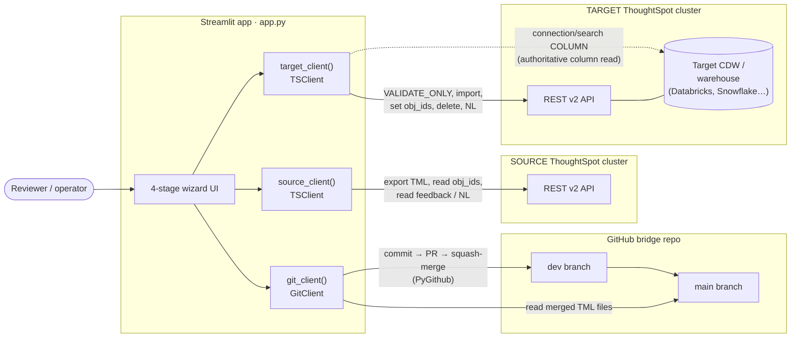

**Under the hood.** One `TSClient` == one cluster (`services/ts_client.py`); the app builds
two. Auth is either an org-scoped **session login** (`auth/session/login` with `org_identifier`)
or a **Bearer token**. The `GitClient` (`services/git_client.py`) wraps PyGithub against
`GITHUB_REPO`. The target's warehouse is reached *through* ThoughtSpot's stored connection
credential — the tool never holds a warehouse secret.

---

## 3. The four-stage pipeline

The wizard is a linear stage machine. Each stage's gate must pass before the next unlocks.

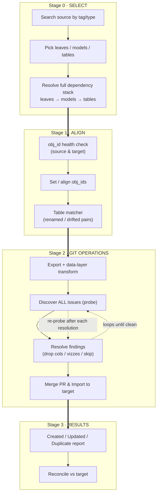

| Stage | Page title | Purpose | Primary calls |
|------|------------|---------|---------------|
| 0 | *Source-cluster assets* | Choose what to promote + resolve its dependency stack | `search_by_tags`, `resolve_promotion` |
| 1 | *obj_id Health Check* | Make target objects share identity with source (update-in-place, not duplicate) | `search_obj_ids`, `update_obj_ids`, `match_tables` |
| 2 | *Git Operations* | Export, transform to target data layer, discover+resolve every blocker, merge & import | `export_tml`, `import_tml` (VALIDATE_ONLY), `commit_tml`/`create_pr`/`merge_pr`, `import_tml` |
| 3 | *Import Results* | Report what was created vs updated-in-place vs duplicated; reconcile | `metadata/search` snapshots |

---

## 4. Stage 0 — Select

**What happens:** the operator searches the source cluster for taggable leaf objects
(liveboards/answers), picks any mix of leaves, models, and tables, and the tool walks the
full dependency graph downward so the *entire promotable stack* is assembled.

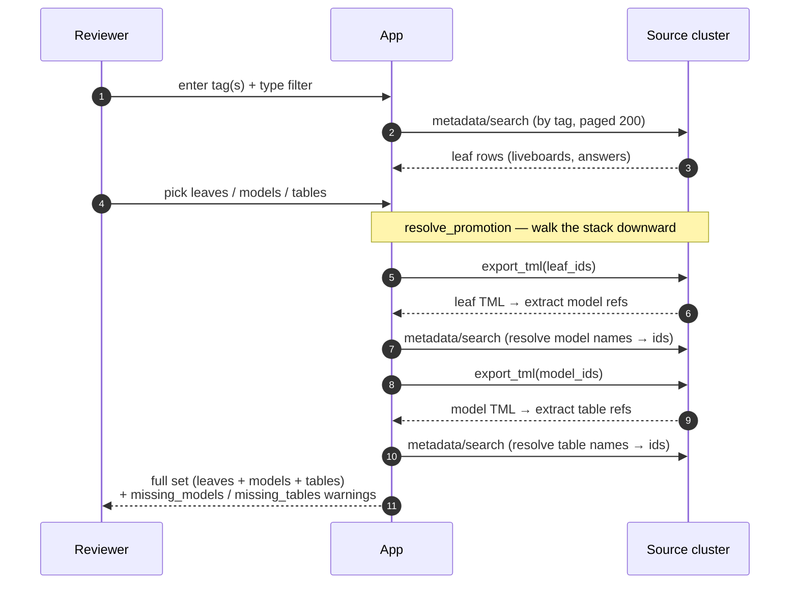

**Under the hood.** `search_by_tags` returns leaf types by default; empty tags ⇒ all
accessible leaves (so untaggable assets can still be picked). `resolve_promotion` accepts
mixed roots — a bare liveboard pulls its whole stack, a bare model pulls its tables, bare
tables pass through. Name→id resolution is exact-match via `metadata/search`. Tables the
model references but that can't be resolved on the source come back as `missing_tables`
(a warning, and a candidate for the *prune / drop table from model* path in Stage 2).

---

## 5. Stage 1 — Align (obj_id identity)

**Why this stage exists:** `obj_id` is the cross-cluster primary key. If the target object
carries the **same `obj_id`** as the source object, import *updates it in place*. If not,
import *creates a duplicate*. This stage guarantees the former.

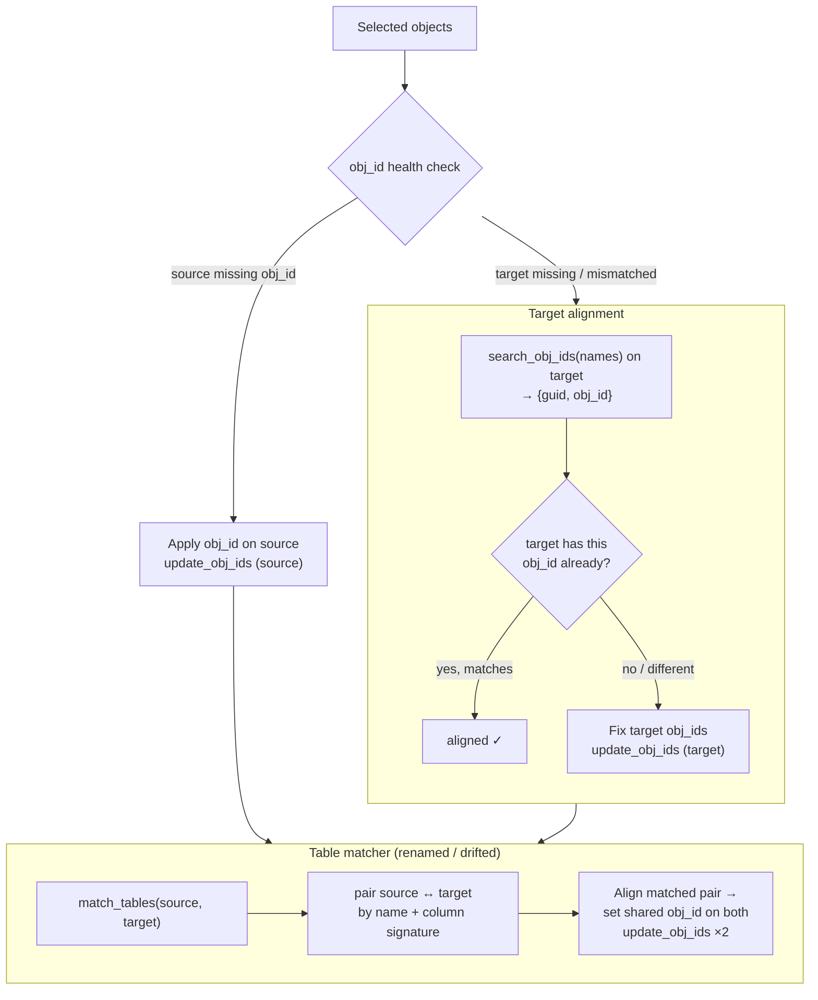

**Under the hood.** `search_obj_ids` maps each object name to `{guid, obj_id}` via
`metadata/search`; a `None` obj_id means the object predates obj_id being enabled.
`update_obj_ids` POSTs to `metadata/update-obj-id` (needs `DATAMANAGEMENT`/`ADMINISTRATION`).
The **table matcher** (`services/table_matcher.py::match_tables`) handles the case where a
target table was renamed or drifted: it pairs by name *and* column signature so a shared
`obj_id` can be stamped on both sides, making a renamed target update-in-place instead of
duplicating.

---

## 6. Stage 2 — Git Operations

The heart of the tool. Four sub-phases run on this one page:
**Export+Transform → Discover → Resolve → Merge & Import.**

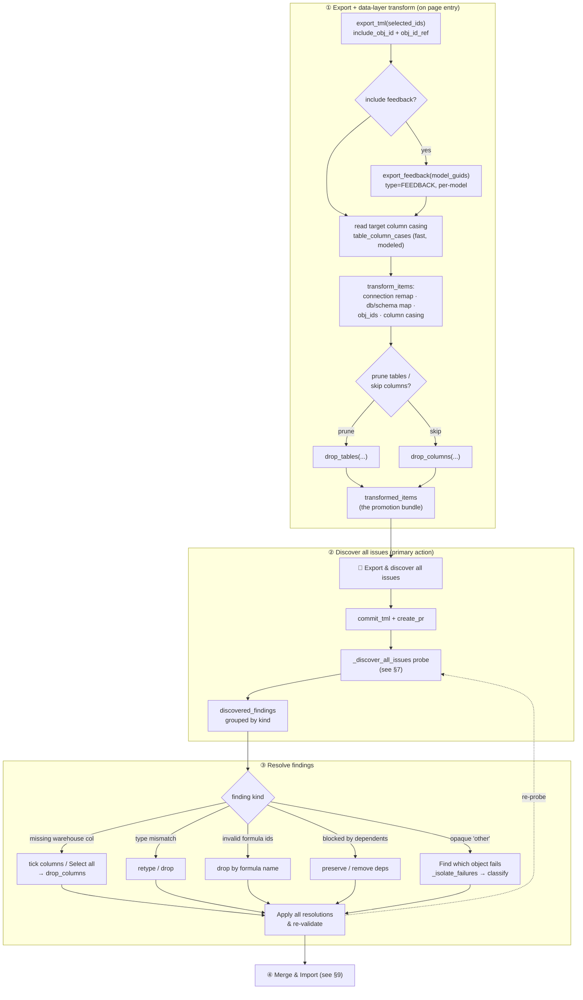

**Under the hood.** Export uses `include_obj_id`/`include_obj_id_ref` so the aligned identity
travels with the TML. Column casing is aligned in two tiers: a **fast** read of tables already
modeled on the target (`table_column_cases`, no warehouse round-trip, runs on entry) and an
**opt-in slow** authoritative read straight from the warehouse
(`connection_column_cases` → `connection/search` with `data_warehouse_object_type=COLUMN`).
The re-export is guarded so plain navigation (Home/breadcrumb) preserves the last stage, but a
feedback-choice change or an obj_id edit forces a fresh export.

---

## 7. Deep dive: the discover / validate / drop engine

This is the mechanism that turns "import fails one error at a time" into "here is the complete,
resolvable list." It runs against a **throwaway copy** of the bundle — the real promotion set
is never mutated by discovery.

### The probe loop

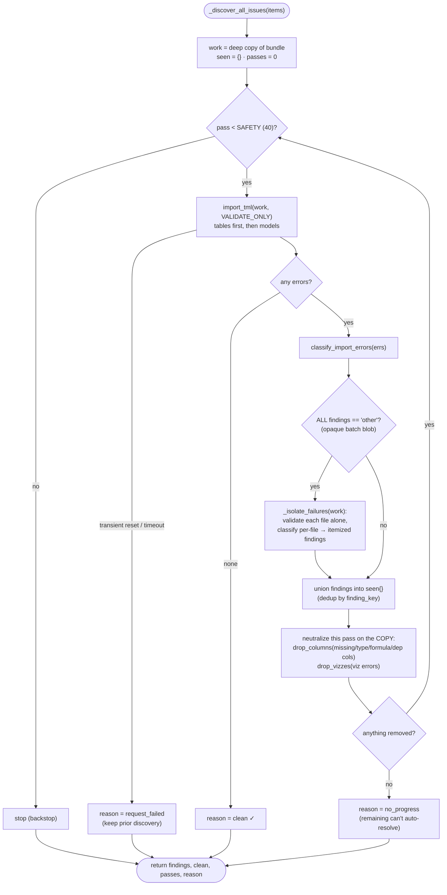

**Why a loop?** ThoughtSpot's `VALIDATE_ONLY` stops at the *first* missing column per table.
Neutralizing each pass's findings on the copy and re-validating surfaces the *next* layer,
until the copy validates clean or a pass can't neutralize anything (`no_progress`). Findings
are unioned across passes and deduped by `finding_key`, so the reviewer sees the complete set.

**The opaque-error escape hatch.** Sometimes the batch validate returns an unactionable blob
(bare `"Schema validation failed"`, no object named). When *every* finding is `kind="other"`,
the probe calls `_isolate_failures` to validate each file **on its own** and re-classify — so
a hidden missing column surfaces as a proper column-level finding instead of forcing a
whole-table skip.

### Per-file isolation

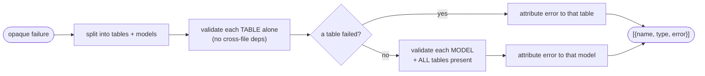

Tables are validated in isolation (no cross-file dependencies); models are validated **with
all tables present** so table refs resolve and only the model varies — a table fault is never
misattributed to a model.

### CDW as the single source of truth

For *missing columns* specifically, the tool prefers the warehouse over trial-and-error:

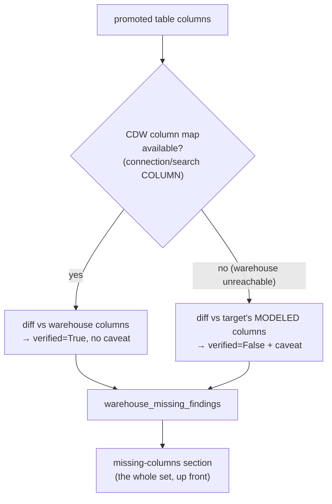

`warehouse_missing_findings` diffs every promoted column against the authoritative warehouse
set in one shot — no whack-a-mole. When the warehouse can't be read, it falls back to the
target's modeled columns and flags each finding `verified=False` with a caveat (the modeled set
can be a subset of the warehouse, so a modeled-but-present column could look falsely missing).

---

## 8. Deep dive: the cascade drop

When a reviewer drops a column, everything that depended on it must go too — or the import
fails with dangling references. `drop_columns` cascades to a **fixpoint**.

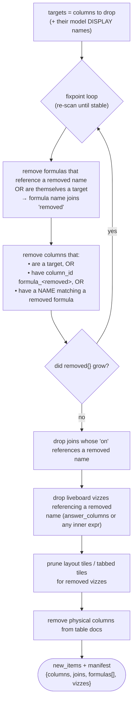

**The subtle bit that took the longest to get right:** a model column that *surfaces a formula*
may link to it by `column_id = formula_<name>` **or by name only** (`column_id` null). Both
must be dropped when the formula goes, otherwise the leftover column dangles as an
*"invalid formula IDs"* error on the next import. The fixpoint re-scans because removing a
formula-surfacing column can in turn orphan another formula.

`column_drop_cascade` is the **dry-run** twin — same logic, mutates nothing — used to preview
the blast radius before the reviewer confirms.

---

## 9. The Merge & Import choreography

Once findings are resolved, this is the ordered sequence that actually lands content on the
target. The ordering is load-bearing — several steps exist to work around platform behaviours.

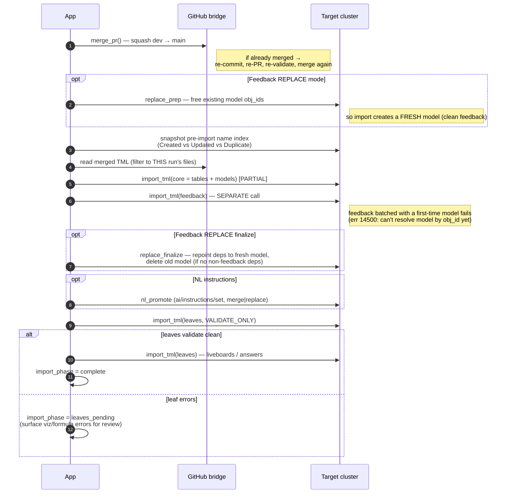

**Under the hood.** `merge_pr` squash-merges; if the PR was already merged it re-commits and
opens a fresh one. Only *this run's* files are imported (`cur_paths` filter) — the team folder
accumulates TML across promotions, so an unfiltered import would re-import unrelated tables (the
"10 tables for a 3-table model" bug). **Feedback imports in its own call after tables+models
commit**, because a first-time model+feedback in one batch fails (error 14500) and under
`ALL_OR_NONE` would roll the model back too. **Leaves are validated before import** so viz/formula
errors surface here rather than silently at leaf import.

---

## 10. Stage 3 — Import Results

**What happens:** the tool reports, per object, whether it was **Created** (new on target),
**Updated in place** (obj_id matched — the goal), or a **Duplicate** (obj_id alignment missed).
The pre-import name-index snapshot taken in Stage 2 is what makes that distinction possible.

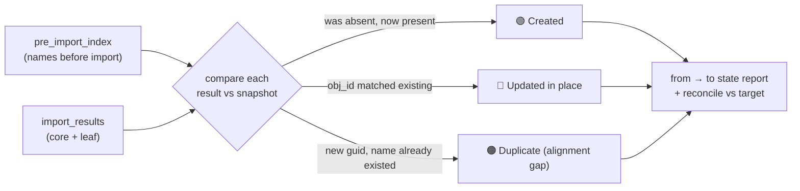

A **Duplicate** verdict is the signal that Stage 1 alignment should be revisited for that object.

---

## 11. Error taxonomy

Every blocker the tool recognises, how it's detected, and the reviewer action offered.
Classification lives in `classify_import_errors`; friendly translations in `friendly_error`.

| Kind | Trigger (verbatim from ThoughtSpot) | Code | Resolution offered |
|------|--------------------------------------|------|--------------------|
| `missing_in_target_warehouse` | *"External column with name: … does not exist in connection …"* | 14536 | Add column to warehouse, **or** drop it + dependents. Enumerated up front from the CDW. |
| `type_mismatch` | *"DataType … does not match CDW DataType for column …"* | — | Retype to target's type, align warehouse, or drop + dependents. |
| `drop_blocked_by_dependents` | *"Deleted columns have dependents. …"* | — | Preserve the column, or remove the dependents on target first. |
| `invalid_formula_ids` | *"…columns use invalid formula IDs. …"* | — | Drop the orphaned formula(s) by name (takes their surfacing columns). |
| `viz_error` | *"Visualization … has following errors …"* | — | Drop the failing viz (`drop_vizzes`), prune its layout tile. |
| `other` | anything unrecognised (e.g. bare *"Schema validation failed"*) | — | Per-file isolation to pin the culprit, then skip/fix that object. |

`friendly_error` additionally humanises operational failures: suspended/paused warehouse,
permission (10086), timeout/504, and connection reset (**10054**, which the client also
auto-retries — see §13).

---

## 12. REST API reference

All endpoints are ThoughtSpot REST **v2.0** (`/api/rest/2.0/…`), plus PyGithub for the bridge.

| Endpoint | Purpose | Where |
|----------|---------|-------|
| `auth/session/login` | org-scoped session login (or Bearer token) | `TSClient.__init__` |
| `metadata/search` | search by tag, resolve name→id, obj_id lookup, dependents, list-all | `search_by_tags`, `search_obj_ids`, `list_dependents`, `find_by_obj_id` |
| `metadata/tml/export` | export TML (`include_obj_id`, `include_obj_id_ref`); `type=FEEDBACK` per model | `export_tml`, `export_feedback` |
| `metadata/tml/import` | `VALIDATE_ONLY` (probe/isolate), `PARTIAL` / `ALL_OR_NONE` (real import) | `import_tml` |
| `metadata/update-obj-id` | stamp `obj_id` on source/target for update-in-place | `update_obj_ids` |
| `metadata/delete` | delete old model in feedback-Replace finalize | `delete_metadata` |
| `connection/search` | infer connection auth (`include_details`); read CDW columns (`data_warehouse_object_type=COLUMN`) | `_connection_meta`, `connection_column_cases` |
| `ai/instructions/get` / `set` | read/write Spotter NL instructions (full-replace semantics) | `get/set_nl_instruction_blocks` |
| GitHub: commit / PR / squash-merge | the promotion transaction (`dev → main`) | `GitClient.commit_tml`, `create_pr`, `merge_pr` |

---

## 13. Key design decisions

- **`obj_id` is identity, not name.** Update-in-place vs duplicate hinges entirely on matching
  `obj_id`. Stage 1 exists solely to guarantee alignment before any import.

- **The CDW is the source of truth for columns.** Rather than discover missing columns one
  import-failure at a time, the tool reads the warehouse's real column set
  (`connection/search COLUMN`) and diffs the whole promotion against it up front. Falls back to
  the target's modeled columns (flagged unverified) only when the warehouse can't be read.

- **Discovery is a fixpoint on a throwaway copy.** The real bundle is never mutated by
  discovery. The probe loops validate→classify→neutralize until `clean`, `no_progress`, or
  `request_failed`, unioning every finding so nothing is missed.

- **Cascades run to a fixpoint too.** Dropping a column transitively removes formulas,
  formula-surfacing columns (even name-linked ones with null `column_id`), joins, vizzes, and
  layout tiles — re-scanning until stable, so imports never fail on dangling references.

- **Idempotent calls retry through transient resets.** `VALIDATE_ONLY` and obj_id-keyed
  update-in-place imports are safe to retry, so `_retry_post` backs off (3s, 8s, 20s) on
  connection resets / timeouts (e.g. WinError 10054 from a gateway dropping a slow warehouse
  validate).

- **Only this run's files import.** The bridge team folder accumulates TML across promotions;
  every import/validate filters to the current run's file set to avoid re-importing stale
  objects.

- **Ordering works around platform quirks.** Feedback imports separately *after* models commit
  (error 14500); leaves validate before import so viz errors surface for review rather than
  silently.
